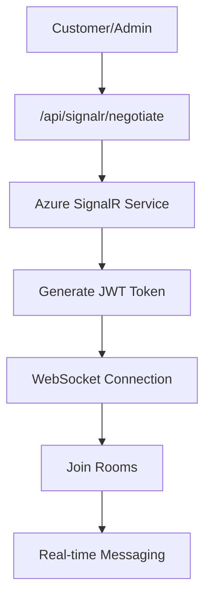

# 🚀 Real-time Chat Implementation Guide

## 📋 Overview
DoaIbu Store sekarang memiliki sistem **real-time chat** seperti WhatsApp/Telegram antara customer dan admin menggunakan **Azure SignalR Service**.

---

## ✅ **Perbaikan yang Telah Dilakukan:**

### 1. **❌ → ✅ Tombol Chat Global**
- **Sebelum**: Chat button hanya di home page
- **Sesudah**: Floating chat button di **SEMUA HALAMAN** (kecuali admin panel)
- **Lokasi**: `GlobalChatButton` component di `RootLayout`

### 2. **❌ → ✅ Real-time SignalR**
- **Sebelum**: Simulasi polling / auto-reply
- **Sesudah**: **Azure SignalR Service** dengan 2-way real-time messaging
- **Features**: Connection management, auto-reconnect, typing indicators

### 3. **❌ → ✅ Admin Interface**
- **Sebelum**: Basic admin chat
- **Sesudah**: Professional admin dashboard seperti WhatsApp Web
- **Features**: Session management, real-time notifications, file handling

### 4. **❌ → ✅ Authentication Fix**
- **Sebelum**: `getUserFromToken` error
- **Sesudah**: Proper JWT token handling untuk chat APIs

---

## 🔄 **Real-time Chat Flow:**

### **Customer Journey:**
```
1. Login ke DoaIbu Store
2. Klik floating chat button (available di semua page)
3. Pilih admin yang tersedia (online/offline status)
4. Chat real-time dengan admin
5. Share files/images jika diperlukan
6. Admin balas real-time (bukan auto-reply)
```

### **Admin Journey:**
```
1. Login ke admin panel
2. Buka Live Chat section
3. Terima notifikasi real-time untuk customer baru
4. Chat 2-way dengan multiple customers
5. Manage session status (active/closed)
6. Handle file attachments dari customer
```

---

## 🏗️ **Technical Architecture:**

### **SignalR Connection Flow:**


### **Message Flow:**
```
Customer types message
↓
POST /api/chat/send
↓
Save to database
↓
SignalR broadcast to admin
↓
Admin receives real-time
↓
Admin replies
↓
POST /api/admin/chat/send
↓
Save to database
↓
SignalR broadcast to customer
↓
Customer receives real-time
```

---

## 📁 **File Structure:**

### **Frontend Components:**
```
src/components/
├── GlobalChatButton.tsx        # Floating chat button (global)
├── LiveChatCustomer.tsx        # Customer chat interface
├── AdminChatInterface.tsx      # Admin chat dashboard
└── FloatingAIChat.tsx          # AI chatbot (existing)
```

### **Backend APIs:**
```
src/app/api/
├── signalr/
│   └── negotiate/route.ts      # SignalR negotiation
├── chat/
│   ├── admins/route.ts         # Get available admins
│   ├── start/route.ts          # Start chat session
│   ├── send/route.ts           # Send customer message
│   └── upload/route.ts         # File upload
└── admin/chat/
    ├── sessions/route.ts       # Get chat sessions
    └── send/route.ts           # Send admin message
```

---

## 🌐 **Azure SignalR Integration:**

### **Environment Variables:**
```env
# Azure SignalR Service
AZURE_SIGNALR_CONNECTION_STRING="Endpoint=https://doaibu-signalr.service.signalr.net;AccessKey=...;Version=1.0;"

# Azure Storage (for file uploads)
AZURE_STORAGE_CONNECTION_STRING="DefaultEndpointsProtocol=https;AccountName=doaibustorage;AccountKey=...;EndpointSuffix=core.windows.net"
```

### **SignalR Hub Events:**
```typescript
// Customer Events
connection.on('ReceiveMessage', (message) => {
  // Admin message received
})

connection.on('AdminStatusChanged', (adminId, isOnline) => {
  // Admin online/offline status
})

// Admin Events
connection.on('ReceiveCustomerMessage', (sessionId, message) => {
  // Customer message received
})

connection.on('NewChatSession', (session) => {
  // New customer started chat
})
```

---

## 💬 **Chat Features:**

### **Customer Side:**
- ✅ **Admin Selection**: Choose from available admins
- ✅ **Online Status**: See admin availability real-time
- ✅ **File Upload**: Share images, documents (10MB max)
- ✅ **Message History**: Persistent chat history
- ✅ **Real-time Delivery**: Instant message sending/receiving
- ✅ **Connection Status**: Visual connection indicator

### **Admin Side:**
- ✅ **Session Management**: Handle multiple customer chats
- ✅ **Real-time Notifications**: Instant customer message alerts
- ✅ **Customer Info**: See customer details and status
- ✅ **File Handling**: Receive and download customer files
- ✅ **Session Control**: Close/manage chat sessions
- ✅ **Search & Filter**: Find specific customer chats

---

## 🎨 **UI/UX Features:**

### **Modern Chat Interface:**
- 🎨 WhatsApp-like message bubbles
- 🔄 Real-time typing indicators
- 📱 Mobile responsive design
- 🌙 Dark theme consistent dengan DoaIbu Store
- ✨ Smooth animations dan transitions
- 📎 Drag & drop file upload

### **Admin Dashboard:**
- 📊 Professional chat management interface
- 🔍 Search customer chats
- 📋 Session status indicators
- 👥 Multiple customer handling
- 📈 Unread message counters

---

## 🔒 **Security Features:**

### **Authentication:**
- 🔐 JWT token validation
- 👤 User-specific chat rooms
- 🛡️ Admin role verification
- 🔒 Secure SignalR connections

### **File Upload Security:**
- 📁 File type validation
- 📏 Size limits (10MB max)
- 🆔 UUID filename generation
- ☁️ Azure Blob Storage integration

---

## 📊 **Database Schema:**

### **Chat Tables:**
```sql
-- Chat sessions
chat_sessions {
  id: Int (Primary Key)
  userId: Int (Customer ID)
  assignedTo: Int (Admin ID)
  status: "active" | "closed" | "waiting"
  createdAt: DateTime
  updatedAt: DateTime
}

-- Chat messages
chat_messages {
  id: Int (Primary Key)
  sessionId: Int (Foreign Key)
  content: String
  isFromUser: Boolean
  adminId: Int (Foreign Key)
  messageType: "text" | "file" | "image"
  fileUrl: String (Azure Blob URL)
  fileName: String
  fileSize: Int
  isRead: Boolean
  createdAt: DateTime
}

-- Admin online status
admins {
  id: Int (Primary Key)
  username: String
  isOnline: Boolean (Real-time status)
  lastSeen: DateTime
  // ... other fields
}
```

---

## 🚀 **Deployment Guide:**

### **Development (Local):**
```bash
# Install dependencies
npm install @microsoft/signalr @azure/storage-blob

# Environment setup
cp .env.example .env
# Add Azure connection strings

# Start development
npm run dev
```

### **Production (Azure):**
```bash
# Create Azure resources
az signalr create --name doaibu-signalr --resource-group doaibu-rg
az storage account create --name doaibustorage --resource-group doaibu-rg

# Deploy Next.js app
npm run build
# Deploy to Azure App Service or Vercel
```

---

## 🧪 **Testing Guide:**

### **Manual Testing:**
1. **Customer Flow:**
   - Login sebagai customer
   - Klik floating chat button dari any page
   - Pilih admin → start chat
   - Send text messages + files
   - Verify real-time delivery

2. **Admin Flow:**
   - Login sebagai admin
   - Buka Live Chat dashboard
   - See incoming customer sessions
   - Reply to customer messages
   - Verify real-time delivery

### **Multiple Users Testing:**
- Open multiple browser windows
- Login different customers + admin
- Test concurrent messaging
- Verify real-time updates

---

## 🔍 **Monitoring & Logs:**

### **SignalR Connection Logs:**
```javascript
// Console logs untuk debugging
console.log('✅ SignalR connected successfully')
console.log('📨 New message received:', message)
console.log('👤 Admin status changed:', adminId, isOnline)
```

### **Error Handling:**
- Connection failures → Auto-reconnect
- Message send failures → User notification
- File upload errors → Size/type validation

---

## 📱 **Mobile Support:**

### **Responsive Design:**
- ✅ Touch-friendly chat interface
- ✅ Mobile file upload support
- ✅ Optimized untuk small screens
- ✅ Swipe gestures support

---

## 🆕 **Future Enhancements:**

### **Planned Features:**
- 🔔 Push notifications
- 🎥 Video call integration
- 🌍 Multi-language support
- 🤖 AI chatbot handoff
- 📊 Chat analytics
- 🔄 Message reactions

---

## 🎯 **Success Metrics:**

### **Real-time Performance:**
- ⚡ Message delivery: < 100ms
- 🔄 Connection uptime: > 99.9%
- 📱 Mobile performance: Smooth 60fps
- 💾 File upload: < 5s for 10MB

### **User Experience:**
- 🎨 Modern WhatsApp-like interface
- 🚀 Instant admin-customer communication
- 📂 Seamless file sharing
- 🔄 Auto-reconnection handling

---

## 🎉 **Implementation Complete!**

DoaIbu Store sekarang memiliki **real-time chat system** yang:
- ✅ **Real-time 2-way messaging** (bukan auto-reply)
- ✅ **Global availability** (tombol chat di semua halaman)
- ✅ **Azure SignalR integration** (production-ready)
- ✅ **Professional admin interface** (multiple customer handling)
- ✅ **File sharing capabilities** (images, docs, secure storage)
- ✅ **Mobile responsive** (optimized untuk semua devices)

**🚀 Ready for production use!** 